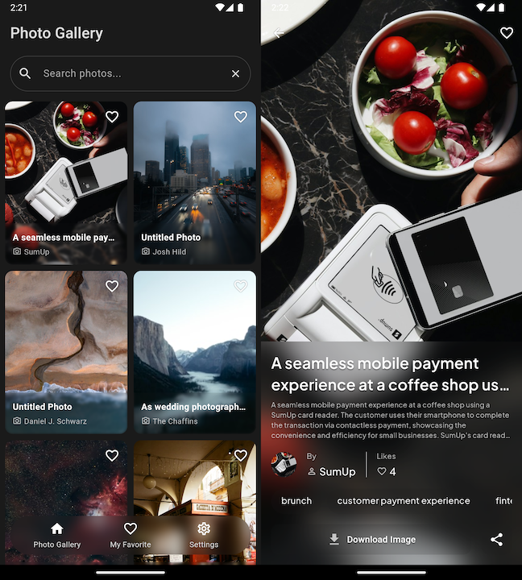

# Photo Album

A modern Flutter application for browsing and managing photos, integrating with multiple photo APIs including Unsplash and Pixabay.



## Video Demo

[](https://drive.google.com/file/d/10RLBRyjg1n3Jyfk37iJGh7vt-KHQOIbh/view?usp=sharing)

> **Note:** Click the badge above to view the application demo video

## Features

### Image Sources

- **Multi-provider support**: Seamlessly switch between Unsplash and Pixabay as image sources through the settings menu
- **High-quality images**: Optimized loading and caching
- **Configurable API settings**: Adaptable for different environments

### Core Functionality

- **Favorite system**: Save and manage your favorite photos
- **Image operations**:
  - Download images
  - Share photos
- **Offline support**:
  - Cache mode for viewing previously loaded images
  - Works without internet connection
- **Responsive loading**: Shimmer animations for smooth user experience

### User Experience

- **Dark mode**: Comfortable viewing in low-light conditions
- **Multi-language support**:
  - 🇬🇧 English
  - 🇮🇩 Bahasa Indonesia
  - 🇯🇵 Japanese
  - 🇨🇳 Chinese

### Technical Features

- Environment management using Flutter flavors
  - Local
  - Development
  - Production
- Route management with GoRouter
- Comprehensive unit tests for photo repository
- Configurable API settings

## Development Setup

### Prerequisites

- [Flutter SDK](https://flutter.dev/docs/get-started/install)
- Android Studio or VS Code
- Valid API keys for:
  - Unsplash
  - Pixabay

### Configuration

The application uses environment-specific configuration files located in `project/config/`:

- API endpoints configuration
- API keys for Unsplash and Pixabay
- Environment-specific variables

### Running the Application

#### Method 1: Using VS Code

1. Create or update `.vscode/launch.json`:

    ```json
    {
        "version": "0.2.0",
        "configurations": [
            {
                "name": "Development",
                "request": "launch",
                "type": "dart",
                "program": "lib/main_dev.dart",
                "args": [
                    "--flavor",
                    "Dev"
                ]
            },
            {
                "name": "Production",
                "request": "launch",
                "type": "dart",
                "flutterMode": "release",
                "program": "lib/main_prod.dart",
                "args": [
                    "--flavor",
                    "Prod"
                ]
            }
        ]
    }
    ```

2. Launch the app using `F5` or `Fn + F5`

#### Method 2: Using Command Line

##### Build App Bundle

```bash
# Production
flutter build appbundle --flavor prod -t lib/main_prod.dart

# Development
flutter build appbundle --flavor dev -t lib/main_dev.dart
```

##### Build APK

```bash
# Production
flutter build apk --flavor prod -t lib/main_prod.dart

# Development
flutter build apk --flavor dev -t lib/main_dev.dart
```

## Localization

### Adding New Languages

1. Create a new JSON file in `assets/translations/`
2. Name the file using the appropriate language code (e.g., `en.json`, `id.json`)
3. Add the language code to the supported languages list in `main_common.dart`

Example translation file structure:

```json
{
    "key": "translated_value"
}
```

## Testing

Run unit tests:

```bash
flutter test
```

The photo repository tests are available in the test directory.

## Contributing

Please read our contributing guidelines before submitting pull requests.
